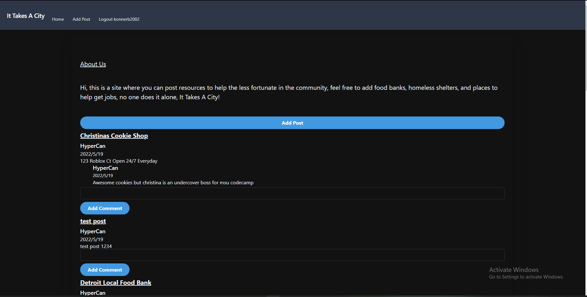

**Project Title:**

It Takes A City

---

**Project Description/Summary:**

An application that provides information for people in need of resources (e.g. food, shelters, etc.). As a user, they would have the ability to add a new food bank information as a resource and add it to the database. Other logged in users can comment on the various posts.

---

**Live Site:**

Heroku link is [here](LINK TBD)

---

**Technology Used:**

- JavaScript
- Express.js
- Sequelize
- MySQL2
- dotenv
- Tailwind
- Auth0

---

**Installation:**

No installation necessary - head to the Heroku link to interact with the deployed site.

**Development installation:**
 Clone from the repository on GitHub. Then in the command line of node.js, use the command "npm install" to get the proper modules installed. Then run mysql and run the schema file. Finally, you can seed the database with npm run seeds.

**Screenshot**

